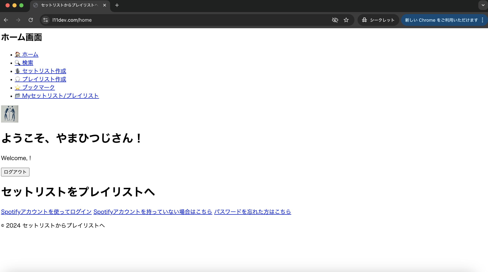
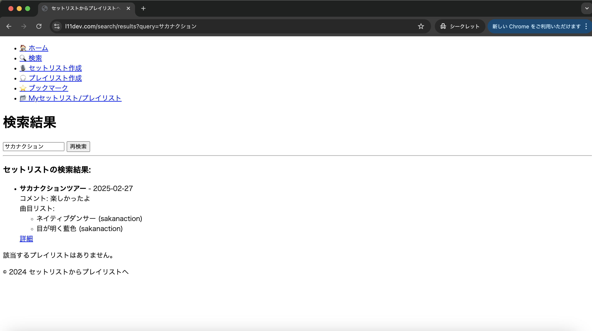
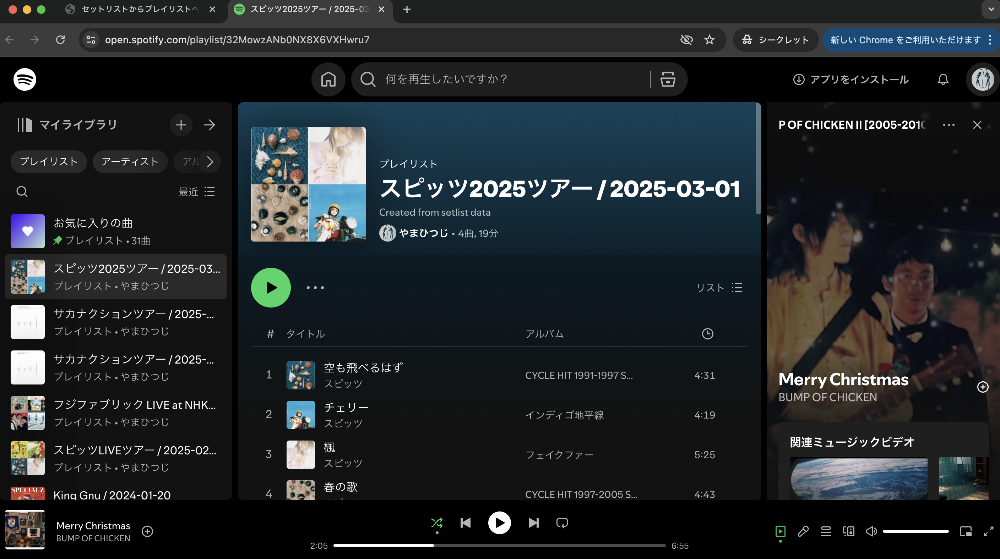

# セットリストからプレイリストへ

## 📝 概要
このアプリは、Spotifyのアカウントでログインをすることで、ライブのセットリストや自身でプレイリストを作成すると、自動でSpotifyにてプレイリストを作成できるWebアプリです。  

自作のセットリスト/プレイリストをいつでも聴くことができる他、
別のユーザーも含め作成したセットリスト/プレイリストを検索、ブックマークをしたり、コメントをすることで他ユーザーと交流することもできます。
  

## 🎧 主な機能

- **ユーザー管理**: Spotifyアカウントでログインし、自分のプレイリストを管理

以下ログイン後のアプリの機能
- **ホーム画面**: ログイン後最初の画面。ログインしたアカウントのSpotify名、設定画像が表示。
- **検索機能**: 全ユーザーが作成したセットリスト/プレイリストを、アーティスト名・曲名・ライブ名から検索可能。
- **セットリストの作成**: Spotify APIを使用し、アーティストや曲を検索、セットリストを作成し自動でSpotifyにてセットリストを作成。
- **プレイリストの作成**: セットリストと同様に作成し自動でSpotifyにてプレイリストを作成  
- **ブックマーク**: 自他問わずブックマークしたセットリスト/プレイリストを表示。
- **Myセットリスト/プレイリスト**: 自作したセットリスト/プレイリストを表示。削除も可能。

## 💻 使用技術
- **フロントエンド**: HTML, CSS, JavaScript
- **バックエンド**: Laravel (PHP)
- **データベース**: MySQL
- **API**: Spotify API
- **インフラ**: Docker, AWS (EC2, ALB, Route53, ACM)
- **認証**: OAuth2.0 (Spotify API との連携のため)

## 📸 画像にてアプリを紹介
目次
- 1.ログイン（Spotifyアカウントを使ってログインを押下）
- 2.ホーム画面
- 3.検索
- 4.セットリスト作成（プレイリスト作成）
- 5.セットリスト作成後の詳細画面
  - 5-1.Spotifyにて再生
  - 5-2.編集ボタンを押した時の画面
  - 5-3.ブックマーク機能
  - 5-4.コメント投稿
- 6.ブックマーク
- 7.Myセットリスト/プレイリスト

### 1.ログイン（Spotifyアカウントを使ってログインを押下）
OAuth2.0を利用してSpotifyにログイン

※ゲスト利用にてログインをすると使える機能が一部制限有り

### 2.ホーム画面
Spotifyアカウントの名前とプロフィール画像が表示

### 3.検索
自他問わず作成されたセットリスト/プレイリストを検索する。下記の項目で検索ができ、該当されたリストが表示。
- セットリスト名/プレイリスト名
- アーティスト名
- 曲名

### 4.セットリスト作成（プレイリスト作成）
- ライブ名
- 開催日（セットリスト作成時のみ入力）
- 作成者コメント
- 曲を検索（アーティスト名/曲名で検索）

"セットリストに追加"ボタンを押してリストに追加、追加した曲は下にスクロールしていくと表示されており、ドラッグで曲順を変更したり削除が可能。

確定したら"セットリストを作成"ボタンを押下

セットリスト作成後、それぞれのボタンを押下すると下記画面に遷移。
- Spotifyでプレイリストを聴く：こちら　→ 5-1
- 編集　→　5-2
- ⭐︎（ブックマーク）　→　5-3
- コメント　→　5-4

### 5.セットリスト作成後の詳細画面

#### 5-1.Spotifyにて再生
"Spotifyでプレイリストを聴く：こちら"を押すと画像の画面に遷移し、作成したリストで再生可能。

#### 5-2.編集ボタンを押した時の画面
ライブ名/開催日/作成者コメントはそのまま、曲のリストは再度検索をし作成。

#### 5-3.ブックマーク機能
"⭐︎"を押下するとブックマークが可能。

下記の6.ブックマーク画面に遷移すると、ブックマークを押下したセットリストやプレイリストが表示される。(6.ブックマークにて画像添付)

#### 5-4.コメント投稿
コメントを投稿すると、最新のコメントから上に投稿した人のSpotifyのプロフィール画像とアカウント名・コメント・投稿時間を表示。５つ以上のコメントがつくと、ページネーションで移動可能。

### 6.ブックマーク
2.検索や、5.セットリスト作成後の詳細画面などからブックマークをつけたセットリスト/プレイリストを表示。

### 7.Myセットリスト/プレイリスト
自身が作成したセットリスト/プレイリストが表示。

